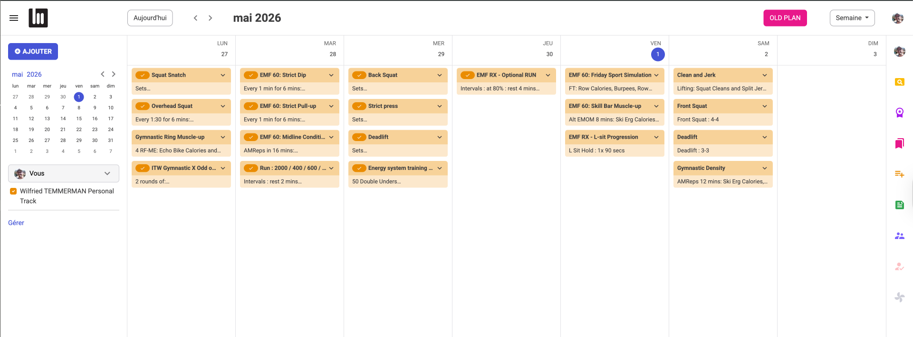

# Strivee to Beyond The White Board synchronisation

Automates the weekly transfer of CrossFit programming from the **Strivee** Android app to **Beyond The Whiteboard (BTWB)**.

## Coverage


> Run `make test-cov` to regenerate with an HTML report in `htmlcov/`.

---

## Goal

Strivee is the app used by the gym to publish the weekly programming (strength, WODs, accessories). BTWB is the platform athletes use to log their workouts. Every Monday, the programming must be manually re-entered into BTWB block by block — this tool automates that entire process.

---

## How It Works

The pipeline runs in four independent steps, each caching its output so any step can be re-run without repeating earlier work.

```
Android phone (Strivee app)
        │
        │  ADB over USB — UI accessibility text dump
        ▼
  1. capture   → captures/<week>/strivee_<ts>_<day>.txt
        │
        │  Ollama text model (local, no API cost)
        ▼
  2. analyse   → parsed/<week>/parsed_<date>_<day>.json
        │
        │  LLM formatting for BTWB (small local model)
        ▼
  3. preview   → terminal log (review before posting)
        │
        │  Playwright browser automation
        ▼
  4. post      → workouts + coaching notes created on BTWB
```

### Step 1 — Capture

Connects to the Android phone via ADB, launches Strivee, navigates to each day tab, and uses `adb shell uiautomator dump` at each scroll position to extract all visible text from Android's accessibility tree. Text elements are deduplicated across scroll positions. Saves one `.txt` file per day — no screenshots, no stitching, no overlap possible.

### Step 2 — Analyse

Sends each day's text dump to a local Ollama text model (`qwen3:8b`). The model extracts every programming block by name, content (workout prescription), and instruction (coaching notes) and returns structured JSON. The output JSON has three fields per block: `name`, `content`, `instruction`.

**Example output** (`parsed/2026-04-27/parsed_2026-04-27_Mon.json`):

```json
{
  "date": "2026-04-27",
  "day_label": "Mon",
  "blocks": [
    {
      "name": "Squat Snatch",
      "content": "EMOMx 8 sets:\nSet 1 à 4: 2 Squat Snatch @70-73% of your 1RM\nSet 5 à 8: 1 Squat Snatch @75-83% of your 1RM",
      "instruction": "Objectif: focus on positions"
    },
    {
      "name": "WOD",
      "content": "AMRAP 12:00\n10 Thrusters #43/29kg\n10 Pull-ups",
      "instruction": ""
    }
  ]
}
```

### Step 3 — Preview

Loads the cached JSON, runs the same LLM formatting as the post step, and prints the result for review. What you see is exactly what will be submitted to BTWB.

### Step 4 — Post

Opens a Playwright browser session, logs into BTWB, and submits each block via the planning form. Blocks already present on BTWB for that date are skipped automatically (duplicate detection via the weekly calendar). The `instruction` field is posted to BTWB's dedicated coaching note field.

<details>
<summary>Result on BTWB</summary>



</details>

---

## Prerequisites

| Requirement | Notes |
|---|---|
| Python 3.13+ | Managed by `uv` |
| [uv](https://docs.astral.sh/uv/) | Package and environment manager |
| [Ollama](https://ollama.com) | Local text model runtime |
| ADB | `brew install android-platform-tools` |
| USB debugging | Enabled on the Android device |
| scrcpy _(optional)_ | Visual mirror during capture — `brew install scrcpy` |

Pull the models once:

```bash
ollama pull qwen3:8b          # text — analyse step
ollama pull qwen3:1.7b        # text — preview and post formatting
```

---

## Installation

```bash
git clone https://github.com/wtemmerman/strivee-btwb.git
cd strivee-btwb
make dev-install
cp .env.example .env
# Edit .env with your BTWB credentials and Ollama model
```

---

## Configuration

Copy `.env.example` to `.env` and fill in the required values:

```env
OLLAMA_TEXT_MODEL=qwen3:8b         # text model for analyse step
OLLAMA_FORMAT_MODEL=qwen3:1.7b     # small text model for preview/post formatting

BTWB_EMAIL=your@email.com
BTWB_PASSWORD=yourpassword
BTWB_TRACK_ID=156552        # visible in BTWB calendar URL: ?t=<id>

# Blocks to skip (case-insensitive substring match)
EXCLUDED_BLOCKS=Hebdomadaire,GROUPE WHATS APP EMF,Warm-up
```

---

## Usage

Run the full pipeline for the current week:

```bash
uv run strivee-btwb run --yes
```

Or step by step:

```bash
# Step 1 — capture all days (Mon–Sat by default) via UI text dump
uv run strivee-btwb capture

# Step 2 — analyse with text model
uv run strivee-btwb analyse

# Step 3 — preview what will be posted
uv run strivee-btwb preview

# Step 4 — post to BTWB (prompts for confirmation)
uv run strivee-btwb post
```

### Flags available on all commands

```bash
--days Mon,Tue,Wed        # process specific days only
--week 2026-04-20         # target a specific week (any date in the week); defaults to current week
--debug                   # verbose logging
```

### Additional flags

```bash
capture --no-scrcpy       # skip launching the screen mirror
post    --yes             # skip interactive confirmation
post    --headless        # run browser without a visible window
```

### Examples

```bash
# Re-run the full pipeline on a past week for testing
uv run strivee-btwb run --week 2026-04-20 --yes

# Analyse and post a specific day from a previous week
uv run strivee-btwb analyse --week 2026-04-20 --days Mon
uv run strivee-btwb post    --week 2026-04-20 --days Mon --yes
```

---

## Development

```bash
make test             # run all tests
make test-cov         # tests with HTML coverage report (htmlcov/)
make lint             # ruff lint check
make format           # ruff format + import sort
```

### Project Structure

```
src/strivee_btwb/
  core/           config, logging setup, data models
  capture/        ADB UI accessibility text dump (adb.py)
  vision/         Ollama text parsing — block extraction (parser.py)
  processing/     LLM-based BTWB formatting — Rx extraction, coaching strip (llm_format.py)
  btwb/           BTWB Playwright automation (client.py)
  pipeline.py     step orchestration and cache I/O
  cli.py          argparse wiring
  __main__.py     entry point

tests/
  unit/
    core/           model tests
    capture/        UI text helpers, element detection, capture_day_as_text
    vision/         JSON extraction, mock Ollama tests
    processing/     Rx extraction, coaching strip
    btwb/           dry-run posting
    test_pipeline   cache I/O, week processing
    test_cli        argument parsing
  fixtures/
    2026-04-27/     real parsed JSON used as test data
```

### Runtime directories (gitignored)

| Directory | Contents |
|---|---|
| `captures/<week>/` | UI text dumps (.txt) |
| `parsed/<week>/` | Text-parsed JSON cache |
| `htmlcov/` | Coverage HTML report |

---

## Design Decisions

### Approach history

| Approach | Result |
|---|---|
| **Qwen2.5-VL (vision)** | Accurate but slow and VRAM-heavy (~15 GB at 8k context) |
| **OCR + LLM** | Fast but poor accuracy — OCR errors compounded into unreliable extraction |
| **Qwen3-VL (vision)** | Better than Qwen2.5-VL but overlap in stitched screenshots caused duplicate content |
| **ADB UI text dump + Qwen3:8b** | Current — zero overlap possible, faster than vision, no VRAM for image processing |

**Hard constraint:** no cloud APIs (zero cost). Every model must run locally via Ollama.

Cloud vision APIs (Claude, GPT-4o) were never tested — they would give better accuracy but introduce per-run cost and a network dependency, which is a non-starter for a weekly personal automation.

### Text model approach

The text model (`qwen3:8b`) receives the raw accessibility-tree text for one day and returns structured JSON. It uses `think=False` to suppress thinking tokens and ensure the visible output is always the JSON response directly.

### LLM-based BTWB formatting

After text parsing, each block's `content` (prescription only) is sent to a small local text model (`OLLAMA_FORMAT_MODEL`, default `qwen3:1.7b`) before preview and post. Since the text parser already separates content from `instruction` (coaching notes), the formatting model works on already-clean prescription text. The model:

1. Keeps only the RX / top-performance section when multiple athlete levels are present (RX, Inter+, Inter, etc.)
2. Removes Strivee UI artifacts (score labels, media counts, etc.)

The `instruction` field is posted directly to BTWB's dedicated coaching note field without further transformation.

If the model returns an empty response the original block content is kept unchanged, so the pipeline never silently drops content.
