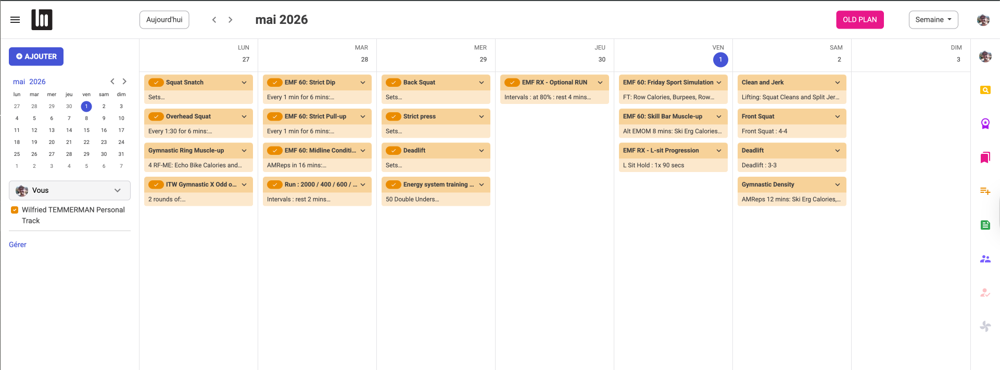

# Strivee to Beyond The White Board synchronisation

Automates the weekly transfer of CrossFit programming from the **Strivee** Android app to
**Beyond The Whiteboard (BTWB)**, and logs the runs and rides **Garmin Connect** recorded
into the same BTWB log.

## Coverage


> Run `make test-cov` to regenerate with an HTML report in `htmlcov/`.

The browser-driving modules (`btwb/client.py`, `btwb/cardio.py`) sit well below that line:
what matters about them is whether BTWB accepts what they send, which is checked by reading
the result back off BTWB, not by a mock agreeing with itself. Their *decisions* — which field
gets which number, which sessions are skipped — are unit-tested; their clicking is not.

---

## Goal

Strivee is the app used by the gym to publish the weekly programming (strength, WODs, accessories). BTWB is the platform athletes use to log their workouts. Every Monday, the programming must be manually re-entered into BTWB block by block — this tool automates that entire process.

The same Monday leaves a second job: BTWB has no import for a watch and no Strava or Garmin
integration, so every run and ride has to be typed in by hand as well. [Garmin → BTWB](#garmin--btwb--runs-and-rides)
does that half.

---

## How It Works

The pipeline runs in five independent steps, each caching its output so any step can be re-run without repeating earlier work.

```
Android phone (Strivee app)
        │
        │  ADB over USB — UI accessibility text dump
        ▼
  1. capture   → captures/<week>/strivee_<ts>_<day>.txt
        │
        │  qwen3:8b — extract blocks from raw UI text
        ▼
  2. analyse   → parsed/<week>/parsed_<date>_<day>.json
        │
        │  qwen3:8b — format for BTWB (same model, same quality)
        ▼
  3. preview   → asks which level to post per multi-level block, then logs
                 content + coaching notes for review
        │
        │  Playwright browser automation
        ▼
  4. post      → workouts + coaching notes created on BTWB
        │
        │  Playwright — read each planned workout back
        ▼
  5. verify    → reports movements BTWB stored other than the ones sent
```

`audit` branches off the same caches to measure what the week's programming leaves
untrained and what accessory work would fill it — read-only by default, or posting
that work to BTWB with `--on` and `--post`.

### Step 1 — Capture

Connects to the Android phone via ADB, launches Strivee, navigates to each day tab, and uses `adb shell uiautomator dump` at each scroll position to extract all visible text from Android's accessibility tree. Text elements are deduplicated across scroll positions. Saves one `.txt` file per day — no screenshots, no stitching, no overlap possible.

<details>
<summary>Example: <code>captures/2026-05-04/strivee_20260505_120721_Mon.txt</code></summary>

```

EMF 60'
LUN
4

MAR
5
MER
6
JEU
7
VEN
8
SAM
9
DIM
10
EMF Rx : Hebdomadaire
🚨 🚨 🚨 CALL HEBDOMADAIRE JEUDI 07/01/26 🚨 🚨 🚨

CALL HEBDOMADAIRE a 18h
...
GROUPE WHATS APP EMF RX
HELLO ! Nouveau sur la prog ?
...
WOD

Box

Noter

PRs

Profil
🔥 Warm-up 🔥
➡️ KB Ankle Stretch : x1min30/side
➡️ 60 Sec/side Adductor stretch with hip rotation
➡️ 60 sec Hand on floor Cossack squat

Muscle Snatch from hip
Hang Muscle Snatch
Low hang Muscle Snatch
Hang Power Snatch
Low Hang Power Snatch

x6 reps / movement
EMF 60 : Snatch
Build to a 1RM Squat Snatch for the day

Gamme suggéré :

Warm-up : 60% / 70% / 75% / 80% #2-3 reps

Build - 1 Rep : @83% / @86% / @88% / @90%

Tentatives lourdes : @93% / @95% / @97% / New RM (si sensation)

Objectif : C'est le jour J du snatch. 8 semaines de progression vers ce moment.
Montez progressivement, ne brûlez pas les étapes. Essayez de respecter les grandes phases
du mouvement avant de vouloir mettre beaucoup de vitesse !

Si vous ratez 3 fois la même charge : arrêtez-vous.

Modifier

11 Scores
EMF 60 - Gymnastic Ring Muscle-up
RX 🔱

AMRAP 5:00
Max sets of 4 Ring Muscle-up Unbroken

Score : total sets / total RMU

Objectif : Format simple, l'objectif n'est pas de vous détruire avant la dernière partie de la séance !
Restez propre et efficace.

INTER+ 🪖
AMRAP 5:00
Max sets of 2 Bar Muscle-up Unbroken

INTER 🎖️
High amplitude ring swing focus x40 reps
Kipping hip extension x12 reps
Bascule feet on the floor x12 reps

+

6-10 Ring Muscle-up
Practice !

3 Media

4 Scores
EMF 60 - ITW Gymnastic X Odd objectif
🔱 Rx - 🪖 INTER+ -

AMRAP 12:00
24 Double Under's
6 Power clean #50/35kg
6 Strict HSPU

🎖️ INTER -

AMRAP 12:00
24 Double Under's
6 Power clean #40/30kg
6 Strict HSPU with abmat

Objectif : DU's unbroken - power clean Tng en 2 séries max - strict HSPU 2 séries max !
9 Scores
```

The raw dump contains navigation chrome (day tabs, bottom bar), excluded blocks (Hebdomadaire, WhatsApp links, Warm-up), UI labels (Modifier, Scores, Media), and multiple athlete levels (RX/INTER+/INTER). The analyse step strips all of this.

</details>

### Step 2 — Analyse

Sends each day's text dump to a local Ollama text model (`qwen3:8b`). The model extracts every programming block by name, content (RX workout prescription only), instruction (coaching notes and level-selection advice), and the scaled INTER+/INTER prescriptions as their own fields, returning structured JSON. The output JSON has five fields per block: `name`, `content`, `instruction`, `inter_plus`, `inter` — the last two are `""` for blocks the gym publishes at a single level.

Keeping each level in its own field is what lets `preview` post INTER+ or INTER without rewriting the workout by hand (see [Step 3](#step-3--preview)).

The model is asked for that split but does not reliably deliver it — it often leaves all three levels inside `content`, or copies them into `instruction`. So the split is finished deterministically after parsing (`_extract_levels`), which is where the level rules actually live:

- a level's prescription is **every** section naming it, joined in source order — Strivee writes shared work under a combined `RX INTER+ INTER` header and each level's own part below it
- text above the first header is shared context only when RX has a section of its own; with no RX header that text **is** the RX prescription, and prefixing it onto a scaled variant would make the athlete do the harder work too
- a dangling `+` at the end of `content` means the prescription was cut in half; the rest is pulled back from `instruction` and the shared half is prefixed onto the variants
- selection criteria stay in the coaching note verbatim — `EMF - INTER + (Je peux faire 1 Strict Muscle-up)` says *who* picks a level, it is not a prescription
- a header can carry its level's target on the same line (`RX 30 Reps UBK +`, `INTER + Sub 7min`). Without emoji that looks exactly like an inline value (`Rx - #2x22,5/ 2x15kg`), so it counts as a header only when a workout sits beneath it and at least two levels are headed that way; stacked one-per-level lines stay inline. The target joins the coaching note like a criterion
- per-level goal times in the coaching note (an `RX` section there that is not the RX workout) are advice for every level, never lifted into a variant — picking INTER+ would otherwise post `Homme - Sub 14:00` as the session
- a variant identical to RX is dropped (a combined `RX INTER` header is one workout, so there is no choice to make), and prescriptions copied into `instruction` are removed so the note never repeats the workout

Known gap: when the model writes the variants into their fields itself and drops the level headers, nothing marks which part was shared, so a variant can arrive holding only its own half. The parse prompt asks for standalone variants (rule 7) to prevent it — but check the preview, which prints the full text of whatever level you chose.

**Example output** (`parsed/2026-04-27/parsed_2026-04-27_Mon.json`):

```json
{
  "date": "2026-04-27",
  "day_label": "Mon",
  "blocks": [
    {
      "name": "Squat Snatch",
      "content": "EMOMx 8 sets:\nSet 1 à 4: 2 Squat Snatch @70-73% of your 1RM\nSet 5 à 8: 1 Squat Snatch @75-83% of your 1RM",
      "instruction": "Objectif: focus on positions"
    },
    {
      "name": "WOD",
      "content": "AMRAP 12:00\n10 Thrusters #43/29kg\n10 Pull-ups",
      "instruction": ""
    }
  ]
}
```

### Step 3 — Preview

Loads the cached JSON, asks which difficulty level to post for every block that offers more than one, runs the same LLM formatting as the post step, and prints the result for review. What you see is exactly what will be submitted to BTWB: the formatted prescription (`content`) and the coaching note (`instruction`) shown separately.

**Choosing a level.** Blocks the gym publishes at a single level are used as-is and never asked about. For the rest, the menu lists only the levels that block actually publishes, so the numbering matches what is on offer:

```
  Wed 2026-08-19 — EMF 60 : Ring Muscle-up Skill
    (all levels start with the same 10 line(s))
    1) RX      For time : / 20/16 Ring Muscle-up
    2) INTER+  AMRAP 6:00 / Max Rep Ring Muscle-up
    3) INTER   Accumulated for Quality : / 12 Negative strict Ring Muscle-up
    Level? [1/2/3, Enter = RX]
```

Levels normally open with the work everyone does, which would make every menu line read identically, so the menu shows only what differs and says how many opening lines they share.

Only the chosen level is posted — no manual rewriting of the workout. The choices are stored in the formatted cache, so `post` reuses preview's answers instead of asking again; `--relevel` discards them, asks again, and reformats.

**One workout per joined part.** A `+`, `Into` or `Then` on its own line joins two pieces of work in one Strivee block ("3 sets of negatives + 2 sets of max reps", "bike sprints Into row sets"). BTWB's generator reads that as one workout and mangles or refuses it, and the formatter drops one side of an `Into`, so after the level is chosen the block is split and each part is formatted and posted on its own, titled `… (1/2)`, `… (2/2)`; the coaching note goes on the first. Cardio blocks join a warm-up and a cooldown the same way — those are not work to log, so a leading part that says warm-up and a trailing part that says cooldown (or ramps down, like the bike's `5min #65 to 40% FTP20`) move to the note, and only the main set is posted.

<details>
<summary>Example preview output (Monday)</summary>

```
============================================================
  BTWB Preview — Week starting 2026-05-04
============================================================
  MON — 2026-05-04  (3 block(s))
  [EMF 60 : Snatch]
      Build to a 1RM Squat Snatch for the day
    ── coaching note ──
      Gamme suggéré :

      Warm-up : 60% / 70% / 75% / 80% #2-3 reps

      Build - 1 Rep : @83% / @86% / @88% / @90%

      Tentatives lourdes : @93% / @95% / @97% / New RM (si sensation)

      Objectif : C'est le jour J du snatch. 8 semaines de progression vers ce moment.
      Montez progressivement, ne brûlez pas les étapes.

      Si vous ratez 3 fois la même charge : arrêtez-vous.
  [EMF 60 - Gymnastic Ring Muscle-up]
      AMRAP 5:00
      Max sets of 4 Ring Muscle-up Unbroken
    ── coaching note ──
      Score : total sets / total RMU

      Objectif : Format simple, l'objectif n'est pas de vous détruire avant la dernière partie de la séance !
      Restez propre et efficace.

      🪖 INTER+ 🪖
      AMRAP 5:00
      Max sets of 2 Bar Muscle-up Unbroken

      🎖️ INTER -
      High amplitude ring swing focus x40 reps
      Kipping hip extension x12 reps
      Bascule feet on the floor x12 reps

      +

      6-10 Ring Muscle-up
      Practice !
  [EMF 60 - ITW Gymnastic X Odd objectif]
      AMRAP 12:00
      24 Double Under's
      6 Power clean #50/35kg
      6 Strict HSPU
    ── coaching note ──
      🎖️ INTER -

      AMRAP 12:00
      24 Double Under's
      6 Power clean #40/30kg
      6 Strict HSPU with abmat

      Objectif : DU's unbroken - power clean Tng en 2 séries max - strict HSPU 2 séries max !
```

The `content` field (the prescription for the level chosen at preview) is posted to the BTWB workout description. The `instruction` field (coaching notes and level-selection advice) is posted to the BTWB coaching note field. The levels you did not choose are not posted.

</details>

### Step 4 — Post

Opens a Playwright browser session, logs into BTWB, and submits each block via the planning form. Blocks already present on BTWB for that date are skipped automatically (duplicate detection via the weekly calendar). The `instruction` field is posted to BTWB's dedicated coaching note field.

**Erg intervals go through BTWB's classic builder, not its AI.** Strivee prescribes erg work by time and watts; BTWB's AI generator asks for a distance per interval or refuses the block. Its classic *Intervals For Distance* template takes exactly what is prescribed — a time per interval and one rest — and the athlete logs the distance. So a cardio block whose main set reads cleanly (`4 sets of : 2min … / 2min Full REST`, `8min RPE 4 / 4min RPE 7 / x 3sets`) skips the LLM formatter: preview shows the plan (`Bike Erg - Intervals For Distance / 4 x 2:00, rest 2:00`), the whole prescription — watts, warm-up, cooldown — goes word for word into the coaching note, and posting fills the template's fields and reads the entered seconds back before planning. A block that does not read cleanly (two modalities, a rest only between sets of several pieces, one steady effort, a distance) stays on the AI path rather than being guessed at.

**Single-movement lifts and gymnastics go through the classic builder too.** BTWB's AI refused `2 sets of : Max rep strict HSPU with Abmat` and `Build a heavy double - 2-pause Squat clean`, stored a tempo back squat at 70% as a plain `5-5-5`, and turned a 10RM seal row into a "Burpee Alternating Dumbbell Clean&Jerk". A block that is nothing but one of these schemes posts through the matching classic template:

| Strivee | BTWB template |
|---|---|
| `3 sets of : 5 Reps Back Squat Tempo 31X1` / rest / `Target weight : #70% 1RM` | Sets, `Tempo Back Squat`, % 1RM |
| `3 Sets of : 6 Reps RPE 7` (movement only in the title) | Sets, the title's movement, heaviest weight |
| `2 sets of : Max rep strict HSPU with Abmat` | Sets, `Strict Handstand Push-up`, all max reps |
| `10RM Barbell Seal Row`, `Build a heavy double - 2-pause Squat clean` | X Rep Max, `Seal Row`, `Pause Squat Clean` |
| `EMOMx12 : 6 reps Butterfly Chest to bar pull-up` | EMOM, `Butterfly Chest-to-bar Pull-up` |

The movement is written the way BTWB names it — the aid (`with Abmat`) and cues (`RPE 7`, `Unbroken`, `touch and go`, `#Bellow the knee`) left to the note, abbreviations expanded — and must agree with the block's title, so a programme header like `3RM en 4 semaines` never posts as a rep max. Posting looks the name up exactly; an unknown one skips that block, reported for adding by hand, and the rest of the day still posts. A load BTWB cannot hold (`@75-80% of your 1RM`) keeps the block on the AI path. A leading `Accumulated N reps / movement` drill list, which names no BTWB movement, goes to the note of the work it leads into.

Every note opens with the prescription as Strivee wrote it, whichever path posts the block: BTWB keeps structure and drops detail (RPE, tempo, a variant), and the athlete should still see it.

<details>
<summary>Result on BTWB</summary>



</details>

To replace a workout, delete only it — `--only` takes exact titles and leaves the rest of the day, accessory work included, alone:

```bash
uv run strivee-btwb delete --week 2026-09-28 --days Wed --only "EMF 60 - Weighted pull-up" --dry-run
```

### Step 5 — Verify

Posting successfully does not mean BTWB stored what was sent. Its AI parser resolves a
movement it does not recognise to an arbitrary other one rather than failing, so a block
can land on the calendar looking fine and hold the wrong exercise.

```bash
uv run strivee-btwb verify --week 2026-08-24
```

```
  Posted-vs-stored check — week starting 2026-08-24
====================================================================
  Tue — 'EMF 60 : Handstand' is not on BTWB
  EMF 60 : Ring Muscle-up Skill: BTWB stored '12 Low Ring Transitions' (33% of it is in the source)
  EMF 60 : Ring Muscle-up Skill: BTWB stored '12 Ring Hip Pulls' (67% of it is in the source)
```

Those are real: `12 Ring Bascule feet on floor` was stored as `12 Low Ring Transitions`.
Measured over two live weeks, one block in six came back altered — common barbell and
gymnastics work survives, ring and skill work is where the parser invents.

It reads each planned workout back and flags any prescription line whose words do not
trace back to the text that produced it, allowing for the rewordings BTWB is entitled to
make (`Strict HSPU` → `Strict Handstand Push-ups`, `Snatch` → `Snatches`).

Two deliberate limits, both chosen so the report stays worth reading:

- **Only lines with a leading rep count are checked.** The event page mixes prescriptions
  with form labels across two different renderings, and no rule that tried to enumerate
  those kept up. A movement stored without a count goes unexamined.
- **It catches substitution, not omission.** A dropped movement leaves nothing to compare.

It also reports blocks that never reached BTWB at all — posting skips a block whose
preview times out, which is otherwise only visible as a workout that quietly never
appeared.

### Optional — Accessory audit

CrossFit programming trains some muscles hard and others not at all. `audit` counts
how many hard sets a week actually delivered to each of eight muscles the
programming tends to miss, and names the accessory work that would close the gap.

```bash
uv run strivee-btwb audit --week 2026-08-24 --location basement
```

```
  MUSCLE                   TARGET    EMF    GAP
  Side delts                  5.0    0.0    5.0
  Chest                       3.0    3.0    0.0
                                  from Weighted Strict Ring Dips 1.8, Barbell Bench Press 1.0
                                  conditioning capped: 2.1 → 2.0
  Calves                      6.0    0.0    6.0

  ── To close the gap at the basement ──
  Side delts                5 sets   Dumbbell Lateral Raise 10-12 / Plate Lateral Raise 15-20
  Calves                    6 sets   Standing Calf Raise 12-20 / Seated Calf Raise 15-20
```

Add `--on` to turn the gap into the block to train, spread across the days you name,
and `--post` to send it to BTWB through the same Playwright flow as the EMF blocks:

```bash
uv run strivee-btwb audit --on Tue,Fri            # show the blocks that would close the gap
uv run strivee-btwb audit --on Tue,Fri --post     # post them (prompts for confirmation)
```

```
  ── Accessory blocks to post ──
  TUE 2026-08-25 — [Accessory]
      12 Standing Calf Raise
      12 Standing Calf Raise
      12 Standing Calf Raise
      15 Seated Calf Raise
      15 Seated Calf Raise
      15 Seated Calf Raise
      12 Leg Extension
      12 Leg Extension
      12 Leg Extension
```

Two things about that shape, both driven by training to failure:

- **The rep target is a single number, not the pool's range.** One number fixes the load
  and says when to add weight; `12-15` does not. The pool keeps the full range, which
  still documents where a movement belongs.
- **One line per set, not per movement.** BTWB gives a written round a single load field,
  so `3 sets of 12 Cable Lateral Raise` can only ever record one weight for all three.
  Written out, every set gets its own row to log a load and a rep count into — which is
  the entire record when the load is the thing being progressed.

When the audit is reading BTWB anyway (`--actual` or `--from-last-week`), it also reports
what you last lifted for each prescribed movement:

```
  Side delts                  5 sets   Cable Lateral Raise 12 / Dumbbell Lateral Raise 10
                                       last Cable Lateral Raise: 10 kg, 10 kg, 12 kg
```

That is the whole progression signal when every set goes to failure against a fixed rep
target: hit the number, then add weight. It is read off each logged row, which carries its
own load (`2 Back Squats | 250 lbs`) — the one-row-per-set layout is what makes a per-set
load exist to read.

Whole muscles move together rather than being sliced across days — five sets of lateral
raises in one session beat two on Tuesday and three on Friday — and a muscle needing four
or more sets is split across two pool movements, because six straight sets of the same
calf raise never reach the soleus.

Accessory blocks are entered through **BTWB's movement search**, not its AI text parser.
The parser resolves a movement it does not recognise to an arbitrary other one instead of
failing — `Cable Lateral Raise` came back as `Clean Deadlift W/ Pause At Mid Shin`, `Pec
Deck` as `Pause Power Clean & Jerks`. Every one of those movements exists in BTWB's
database and its own search finds them by exact name; only the parser misses them. So
`post_week(exact_movements=True)` seeds a workout, then adds each set through the search
and deletes the seed. It costs a round-trip per set and cannot log the wrong exercise.

EMF blocks keep the prose path — their text is real workout prose the parser handles well.

The block is built deterministically and **never passed through the format model**: the
pool already stores BTWB's own movement names, so there is nothing for the formatter to
improve and a great deal for it to break. Every block is titled `Accessory` on every date;
BTWB dedupes on the title, so re-posting is a no-op. That also means an edited plan will
be *skipped* rather than updated — clear it with `delete` first.

### Counting what you actually did

By default the audit counts everything the week *programmed*. `--actual` counts only the
blocks logged as done on BTWB:

```bash
uv run strivee-btwb audit --week 2026-08-17 --actual
```

```
Mon — not logged as done: EMF 60 : Weighted Pull-up
Tue — not logged as done: EMF 60 : Deadlift, EMF 60 : Energy System Training
...
  Accessory audit — week starting 2026-08-17  (gym, logged as done)
```

It reads completion from the same week view the duplicate check already loads — a
completed block carries a check badge inside its title row (`.badge-track-orange
.mdi-check`, which BTWB also nests under `.track-event-event-results`). Nothing about
what was lifted is read, only whether the session happened.

Two things worth knowing:

- **Use it on a finished week.** Run mid-week and it correctly reports the days that have
  not happened yet as not done, which makes the gap look enormous.
- **Titles are matched with whitespace collapsed.** Block names carry the source's own
  spacing (`EMF 60 :  Handstand Walk` has a double space) on both sides, and comparing
  them raw would break the moment either side tidied it.

The filter is applied after the extraction cache, so `--actual` costs no extra model
calls over a plain run.

### Planning this week from last week

`--from-last-week` measures the previous week's *completed* work and uses it as the
baseline for the week you are planning (it implies `--actual`):

```bash
uv run strivee-btwb audit --from-last-week --on Tue,Fri --post
```

```
  Accessory audit — week starting 2026-08-17  (gym, logged as done)
  Measured as the baseline for the week starting 2026-08-24
```

This is the form to use week to week. This week's delivery is not knowable until this
week is over, and the most recent finished week is the best available estimate of what
the coming one will leave untrained — the gap is structural enough for that to hold, since
side delts and calves get nothing regardless of which sessions you make.

**Accessory blocks are excluded from the baseline**, and that is not cosmetic. Counting
last week's accessory work into it makes the system undo itself: five sets one week, a
satisfied target and zero the next, five again the week after — half the target on
average, in a loop that looks correct at every step.

It reads each day at the level `preview` selected, falling back to RX (and saying
so) for days that were never previewed. Two hand-maintained tables drive it:

| File | Holds |
|---|---|
| `data/exercise_pool.json` | The accessory movements available per muscle, tagged gym/basement, with the weekly set target for each muscle |
| `data/movement_muscles.json` | What one credited set of a CrossFit movement is worth to each of those muscles |

The counting rules live in `processing/volume.py`, deliberately apart from the model.
The model only reads coach shorthand into a list of movements and set counts; what a
set is *worth* stays a table. Conditioning counts 0.25 per set and is capped at 2.0
per muscle per week — without that cap a single high-rep metcon reports every muscle
as covered. Heavy singles and "for quality" work count zero.

A movement the tables do not recognise is printed under **Not credited** rather than
scored as zero, so a gap in the table shows up instead of hiding.

---

## Garmin → BTWB — runs and rides

BTWB offers no watch import and no Strava or Garmin integration — it is a standing feature
request, not a feature. `garmin` reads what Garmin Connect recorded and enters it the way a
person would: movement, scoring model, numbers, date and notes.

```
Garmin Connect (the watch auto-syncs over Bluetooth, so the cloud copy is always there)
        │
        │  garminconnect — refresh tokens stored once by `garmin-login`
        ▼
  1. fetch     → garmin/<week>/activities.json   (laps fetched for runs only)
        │
        │  lap intensities → BTWB's scoring model
        ▼
  2. map       → one CardioSession per BTWB entry
        │
        │  Playwright — Log → Single Movement Workout → … → Log Result
        ▼
  3. sync      → logged on BTWB, skipping what it already holds
```

### Which BTWB model a session becomes

BTWB offers six scoring models for a distance movement. Two are used:

| Session | BTWB model |
|---|---|
| A continuous run or ride | **Single Distance** |
| 5 × 500m, a ladder, any repeats | **Intervals / Repeats** |

Garmin labels every lap of a structured workout `WARMUP` / `ACTIVE` / `REST` / `RECOVERY`, so a
rep session is readable from the lap sequence alone: repeated `ACTIVE` efforts with `REST`
between them.

Garmin's own `hasIntensityIntervals` flag is **not** the test. It is also true of a Zone 2 run
whose only structure is a warm-up block — one continuous effort as far as BTWB is concerned —
and trusting it would invent reps that were never run.

A prescription can also jog its recovery, and KipRun writes those as further `ACTIVE` steps, so
a ladder arrives with no `REST` lap anywhere. A second rule catches those: four or more efforts,
none longer than `AUTO_LAP_M` (800 m). Auto-lap fires every kilometre, so a session whose every
labelled effort is shorter than that was lapped on the prescription, not on the odometer.

**Intervals / Repeats, not For Distance.** The two read alike and mean opposite things —
Intervals / Repeats is *multiple efforts each performed for time* (500 m, how fast?), For
Distance is *multiple efforts each performed for distance* (3 minutes, how far?). A rep session
off a running plan is the former.

### What lands in BTWB

The logger names an entry after the movement and offers no title field, so the name the session
was prescribed under survives only in the notes — which is where it goes, ahead of the metrics:

```
St-Gabriel-de-Brandon - 5 x 500m (R=200m)          ← notes
Avg HR 139 bpm · Max 178 bpm
Avg pace 5:41 /km
Elevation gain 95 m
https://connect.garmin.com/modern/activity/23865416880

Run : 5x 500 m, rest 1:22 : 51 mins 7 secs | Rx'd  ← what BTWB stores
Intervals : rest 1:22
Run, 500 m | 1:58 · 2:03 · 1:56 · 1:59 · 2:01
```

Rest is entered as the mean of what was actually taken rather than the nearest preset: BTWB
stores one value, and a measured 1:22 is worth more than a tidy 1:30. RPE is left unset.

### Commutes

Short rides repeat twice a day — out to the box and home again — and are travel, not training.
Below `MIN_BIKE_KM` (default 10 km) a day's rides fold into a single entry instead of one per
leg, summing distance and time and averaging heart rate by time on the bike.

`--no-commutes` leaves them out altogether. Merging is right for a week; across three months,
fifteen days of riding to the box buries what was actually trained.

### What stops it posting twice

BTWB is the ledger, not a file on this machine. Every session this tool writes carries its
Garmin link in its notes, so what has already been synced is read back out of the log itself
before anything is written.

That needs no seeding for sessions logged before the sync existed, and it cannot go on claiming
an entry is there after it was deleted on BTWB. Any overlap counts as synced: a commute day that
gained a third ride after it was logged is left alone rather than posted again, because a
duplicate is worse than a merged entry one leg short.

### The cache

Each fetched week is cached raw under `garmin/<week>/`. A week that has not ended is never
served from it — that file was written mid-week and cannot know about Friday's run. Weeks that
are over come off disk, because Garmin rate-limits by IP (hard enough that a login burst answers
429 before anything else) while the mapping is free to re-run.

---

## Prerequisites

| Requirement | Notes |
|---|---|
| Python 3.13+ | Managed by `uv` |
| [uv](https://docs.astral.sh/uv/) | Package and environment manager |
| [Ollama](https://ollama.com) | Local text model runtime |
| ADB | `brew install android-platform-tools` |
| USB debugging | Enabled on the Android device |
| scrcpy _(optional)_ | Visual mirror during capture — `brew install scrcpy` |
| Garmin Connect account | Only for `garmin` — `garmin-login` stores tokens; no API key or approval needed |

Pull the model once:

```bash
ollama pull qwen3:8b          # text — analyse, preview, and post formatting
```

---

## Installation

```bash
git clone https://github.com/wtemmerman/strivee-btwb.git
cd strivee-btwb
make dev-install
cp .env.example .env
# Edit .env with your BTWB credentials and Ollama model
```

---

## Configuration

Copy `.env.example` to `.env` and fill in the required values:

```env
OLLAMA_TEXT_MODEL=qwen3:8b         # text model for analyse step
OLLAMA_FORMAT_MODEL=qwen3:8b       # text model for preview/post formatting (same model)
# Optional Ollama tuning (sensible defaults if unset):
# OLLAMA_NUM_CTX=16384             # context window — must exceed the parse prompt + a day's text
# OLLAMA_KEEP_ALIVE=10m            # keep the model resident across a run

BTWB_EMAIL=your@email.com
BTWB_PASSWORD=yourpassword
BTWB_TRACK_ID=156552        # visible in BTWB calendar URL: ?t=<id>

# Required when more than one device/emulator is connected (phone + emulator running at the same time).
# Without it, adb refuses to run. Find the serial with: adb devices
ANDROID_SERIAL=0B241FDD4003UN

# Garmin sync only — both optional, shown with their defaults
# GARMIN_TOKENSTORE=~/.garminconnect   # where `garmin-login` writes its refresh tokens
# MIN_BIKE_KM=10                       # rides shorter than this count as travel, not training

# Blocks to skip (case-insensitive substring match)
EXCLUDED_BLOCKS=Hebdomadaire,GROUPE WHATS APP EMF,Warm-up
```

---

## Usage

Run the full pipeline for the current week:

```bash
uv run strivee-btwb run --yes
```

Or step by step:

```bash
# Step 1 — capture all days (Mon–Sat by default) via UI text dump
uv run strivee-btwb capture

# Step 2 — analyse with text model
uv run strivee-btwb analyse

# Step 3 — preview what will be posted
uv run strivee-btwb preview

# Step 4 — post to BTWB (prompts for confirmation)
uv run strivee-btwb post

# Step 5 — check BTWB stored what was sent
uv run strivee-btwb verify

# Optional — report the week's per-muscle volume and the accessory work it leaves
uv run strivee-btwb audit --location basement

# ...and post that accessory work to BTWB on the days you choose
uv run strivee-btwb audit --location basement --on Tue,Fri --post

# Week to week: plan from what you actually completed last week
uv run strivee-btwb audit --from-last-week --on Tue,Fri --post
```

Log the week's running and riding from Garmin:

```bash
# Once, ever — may ask for an MFA code; tokens are stored outside the repo
uv run strivee-btwb garmin-login

# Show what the last 7 days would put on BTWB, writing nothing
uv run strivee-btwb garmin

# ...and write it
uv run strivee-btwb garmin --post

# A named week instead of the last 7 days
uv run strivee-btwb garmin --week 2026-09-07 --post

# Backfill three months of training, leaving the commutes out
uv run strivee-btwb garmin --days-back 92 --no-commutes --post
```

Without `--post` the form is walked but never submitted, so the preview is what BTWB itself
made of each session rather than a guess at it. Running it twice is safe: the second run finds
everything already there and writes nothing.

To clear a week's planned workouts off BTWB (e.g. to re-post after a fix):

```bash
# List what would be deleted, without deleting (always safe to run first)
uv run strivee-btwb delete --dry-run

# Delete all planned workouts for the week (prompts for confirmation)
uv run strivee-btwb delete
```

Only *planned* workouts are deleted; completed/logged sessions are left untouched.
Deletion is keyed on the exact dates requested, so it can never affect another week.
It scans the week view, one load per week the dates span — the month view keeps its day
containers in the DOM without making them visible, so waiting for one timed out and
delete reported nothing to delete however many workouts were planned.

### Flags available on all commands

```bash
--days Mon,Tue,Wed        # process specific days only
--week 2026-04-20         # target a specific week (any date in the week); defaults to current week
--debug                   # verbose logging
```

### Additional flags

```bash
capture --no-scrcpy       # skip launching the screen mirror
preview --relevel         # re-ask the per-block level choice and reformat
post    --relevel         # same, when posting without a fresh preview
post    --yes             # skip interactive confirmation
post    --headless        # run browser without a visible window
delete  --yes             # skip interactive confirmation
delete  --headless        # run browser without a visible window
delete  --dry-run         # list workouts that would be deleted, then stop

audit   --location gym    # gym | basement — decides which pool movements are offered
audit   --actual          # count only blocks logged as done on BTWB
audit   --from-last-week  # measure the previous week's completed work (implies --actual)
audit   --on Tue,Fri      # turn the gap into the block to train on those days
audit   --post            # post that block to BTWB (needs --on)
audit   --yes             # skip the confirmation before posting
audit   --headless        # run browser without a visible window
audit   --dry-run         # show what --post would send, without posting

garmin  --days-back 92    # days of history to sync, ending today (default: 7)
garmin  --week 2026-09-07 # sync a whole week instead, Mon–Sun, by any date in it
garmin  --min-bike-km 10  # rides below this are travel: a day's short rides become one entry
garmin  --no-commutes     # leave the short rides out entirely instead of merging them
garmin  --post            # write to BTWB (default: show only)
garmin  --yes             # skip the confirmation before posting
garmin  --headless        # run browser without a visible window
garmin  --refetch         # ask Garmin again instead of reading cached weeks
```

### Examples

```bash
# Re-run the full pipeline on a past week for testing
uv run strivee-btwb run --week 2026-04-20 --yes

# Weekly: plan accessory work from what you actually completed last week
uv run strivee-btwb audit --from-last-week --on Tue,Fri --post
uv run strivee-btwb verify

# Analyse and post a specific day from a previous week
uv run strivee-btwb analyse --week 2026-04-20 --days Mon
uv run strivee-btwb post    --week 2026-04-20 --days Mon --yes

# Delete a specific day's planned workouts from a week
uv run strivee-btwb delete  --week 2026-04-20 --days Mon --yes
```

---

## Development

```bash
make test             # run all tests
make test-cov         # tests with HTML coverage report (htmlcov/)
make lint             # ruff lint check
make format           # ruff format + import sort
make typecheck        # mypy static type checks
make check            # lint + typecheck + tests (what CI runs)
```

Optional git hooks run ruff (lint + format) on each commit:

```bash
uv run pre-commit install
```

GitHub Actions (`.github/workflows/ci.yml`) runs lint, format-check, mypy, and
tests on every push to `main` and on pull requests.

### Project Structure

```
data/             hand-maintained accessory tables (exercise pool, movement→muscle credits)

src/strivee_btwb/
  core/           config, logging, data models, Ollama wrapper (llm.py)
  prompts/        LLM prompt templates as .txt files
  capture/        ADB UI accessibility text dump (adb.py)
  garmin/         Garmin Connect — token auth, fetch, rate-limit backoff (client.py),
                  raw per-week activity cache (cache.py)
  vision/         Ollama text parsing — block extraction (parser.py)
  processing/     LLM-based BTWB formatting — Rx extraction, coaching strip (llm_format.py)
                  posted-vs-stored check (movement_check.py), logged loads (loads.py)
                  accessory audit — set extraction (set_extract.py), counting rules (volume.py),
                  gap → postable block (accessory.py)
                  Garmin activity → BTWB entry, incl. interval detection (garmin_map.py)
  btwb/           BTWB Playwright automation — post + delete (client.py),
                  cardio result logging + sync dedupe (cardio.py)
  pipeline.py     step orchestration and cache I/O
  cli.py          argparse wiring
  __main__.py     entry point

tests/
  unit/
    core/           model tests
    capture/        UI text helpers, element detection, capture_day_as_text
    vision/         JSON extraction, mock Ollama tests
    processing/     Rx extraction, coaching strip, set counting + credit rules, accessory planning
    btwb/           dry-run posting, delete, calendar dedup, cardio form rules
    garmin/         rate-limit backoff, token requirement, week cache
    benchmark/      benchmark comparator tests
    test_pipeline   cache I/O, week processing
    test_audit_cache  set-cache invalidation, which level the audit counts
    test_garmin_sync  sync window, cache rule, dedupe against BTWB
    test_cli        argument parsing
  benchmark/        accuracy + timing harness (run via `make benchmark`)
  fixtures/
    2026-04-27/     real parsed JSON used as test data
```

### Runtime directories (gitignored)

| Directory | Contents |
|---|---|
| `captures/<week>/` | UI text dumps (.txt) |
| `parsed/<week>/` | Text-parsed JSON cache |
| `formatted/<week>/` | Cleaned + LLM-formatted block cache, including the chosen level per block (lets `post` reuse `preview`'s output and answers) |
| `parsed/<week>/sets_*.json` | Per-day set extraction for `audit`, keyed on a hash of the block text it was read from |
| `garmin/<week>/` | Raw Garmin activities as fetched, laps included for runs |
| `tests/benchmark/baselines/`, `tests/benchmark/results/` | Benchmark snapshots + timing CSVs |
| `tests/benchmark/llm_cache/` | Benchmark-only model answers, keyed on model digest + prompt + options |
| `htmlcov/` | Coverage HTML report |

---

## Performance

The benchmark gates three LLM stages. `analyse` and `format` are compared block by
block; the audit's **set extraction** is gated on the per-muscle volume it credits rather
than on its wording, because the volume is what the audit acts on — the model may reword a
movement or split a block differently, it may not change what the week is judged to have
delivered. A movement the credit table does not recognise fails the run rather than being
noted, since it means the week is being under-counted silently.

The set stage only runs for weeks that have a `sets` baseline, so run
`make benchmark-baseline` once to start gating it.

**Model response cache.** A full run asks the model about 950 prompts — about an hour on
one GPU — yet most changes are to the code around the model, not to what it is asked. At
temperature 0 the model gives a prompt the same answer every time, so the benchmark stores
each answer under `tests/benchmark/llm_cache/`, keyed on the model's digest, the full prompt
and the options, and asks the model only the prompts that changed. A change to parsing or
splitting reruns every week in about a second; a prompt edit or a re-pulled model misses the
cache and pays in full for what it touched. Real `analyse`/`preview` runs never use it.
`--no-cache` asks the model everything — the way to check the model still answers as it did:

```bash
uv run python -m tests.benchmark.compare --no-cache
```

The slow parts are the local LLM stages (analyse, format) and the device/browser
round-trips (capture, post). Optimizations are gated by an accuracy benchmark
(`make benchmark`) that re-parses saved captures and diffs against a snapshot of
the current `qwen3:8b` output — so speed changes are only kept if extraction stays
identical.

What helps (all output-preserving):

- **Formatted-week cache** — `preview` and `post` previously each ran the LLM
  formatter over the whole week; the formatted result is now cached per day
  (`formatted/<week>/`, invalidated when its parsed source is re-analysed), so a
  `preview` → `post` run formats once, not twice.
- **One calendar load in `post`** — the duplicate-check now loads the BTWB week
  view once and scans all days, instead of once per day.
- **Cached device size + trimmed settle waits in capture** — the screen size is
  read once per session instead of on every swipe; a couple of conservative sleep
  reductions. Screenshot-based scroll-end detection is untouched (accuracy-critical).
- **Explicit `num_ctx` / `keep_alive`** — bounds the context window safely above
  the largest prompt and keeps the model resident across a run.

What does **not** help here (measured, not assumed): running the per-day analyse
or per-block format calls **concurrently** is ~5× *slower* on a single GPU because
these calls are prefill-bound (the ~4K-token parse prompt dominates), so four
concurrent prefills just contend for the one GPU. The pipeline therefore calls the
model sequentially. Do **not** set `OLLAMA_NUM_PARALLEL > 1` expecting a speedup
for this workload. A genuinely faster LLM stage would need a smaller/faster model
(kept as `qwen3:8b` for accuracy) — evaluate any swap with `make benchmark` first.

## Design Decisions

### Approach history

| Approach | Result |
|---|---|
| **Qwen2.5-VL (vision)** | Accurate but slow and VRAM-heavy (~15 GB at 8k context) |
| **OCR + LLM** | Fast but poor accuracy — OCR errors compounded into unreliable extraction |
| **Qwen3-VL (vision)** | Better than Qwen2.5-VL but overlap in stitched screenshots caused duplicate content |
| **ADB UI text dump + Qwen3:8b** | Current — zero overlap possible, faster than vision, no VRAM for image processing |

**Hard constraint:** no cloud APIs (zero cost). Every model must run locally via Ollama.

Cloud vision APIs (Claude, GPT-4o) were never tested — they would give better accuracy but introduce per-run cost and a network dependency, which is a non-starter for a weekly personal automation.

### Text model approach

The text model (`qwen3:8b`) receives the raw accessibility-tree text for one day and returns structured JSON. It uses `think=False` to suppress thinking tokens and ensure the visible output is always the JSON response directly.

### Dropped-block recovery

A `EMF ...` block sandwiched between two excluded blocks (e.g. a short "EMF 60 - Optional RUN" between an excluded "Hebdomadaire" announcement and an excluded "Swim Workout") is sometimes merged into a neighbour by the full-text parse and lost. `count_block_titles` still finds the title with a regex, so after the main parse any non-excluded title that is missing from the result triggers a **focused single-block re-extraction** (`recover_block.txt`) — asking the model for just that one block, which it handles reliably even when the full multi-block parse failed the boundary. Recovery only runs when a block is actually missing, so complete days are untouched. Optional extras published under a bare `<Name> - OPTION` title (`Gymnastic Vaccin - OPTION`) count as titles too; the model never returns them on its own and folds them into the block above, so recovery restores them and the trim cuts the block above at their title.

### LLM-based BTWB formatting

After text parsing, each block's `content` (prescription only) is sent to `OLLAMA_FORMAT_MODEL` (`qwen3:8b`) before preview and post. The same model is used for both analyse and format steps — `qwen3:8b` gives reliable output quality for text fidelity; smaller models (e.g. 1.7b) hallucinate movements and leak thinking-token artifacts. Since the text parser already separates content from `instruction` (coaching notes), the formatting model works on already-clean prescription text. The model:

1. Keeps only the single prescription it was given — the level chosen at preview, since the parser already split RX / Inter+ / Inter into separate fields
2. Removes Strivee UI artifacts (score labels, media counts, etc.)

The `instruction` field is posted directly to BTWB's dedicated coaching note field without further transformation.

If the model returns an empty response the original block content is kept unchanged, so the pipeline never silently drops content.

### Reading the watch through Garmin Connect, not over USB

The watch pushes every activity to Garmin Connect over Bluetooth within minutes of finishing,
so the cloud copy is the one that appears without anybody doing anything. Reading FIT files off
the watch over USB needs it plugged in — which is the one thing an automatic sync must not
require, and recent Garmin watches present MTP, which macOS does not mount natively.

The cost is that neither end is an official API. Garmin publishes none for a personal account,
and BTWB's logger is a form. Both can break on a deploy, and both fail loudly when they do: a
rate-limited fetch raises rather than returning an empty week, and a save is confirmed from the
POST and read back off the page that submits it rather than assumed from a click.

### Walking BTWB's form instead of its internal endpoints

BTWB's web app posts to endpoints that could be called directly with a session cookie. The form
is driven instead, because it is the only path that stays honest about what BTWB understood: the
page that submits an entry shows every effort, the scored total and the hidden ISO date it will
file under, and all three are checked before it saves. A hand-built payload would be faster and
would tell you nothing about whether BTWB read it the way you meant.
